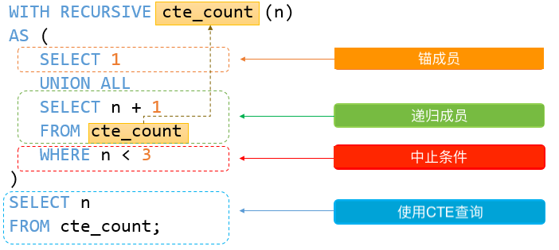

[TOC]

# MySQL

###  第1节 Mysql入门
本节将开始介绍和学习使用MySQL。我们将开始安装MySQL，下载示例数据库并将数据导入到MySQL服务器以进行练习。  
* 安装MySQL数据库服务器 - 演示如何在计算机上安装MySQL数据库服务器

* 下载MySQL示例数据库 - 介绍一个名称为yiibaidb的MySQL示例数据库，提供下载示例数据库及ER图

* 将示例数据库导入到MySQL数据库服务器中 - 演示如何将示例数据库(yiibaidb)导入到MySQL数据库服务器中进行练习

###  第2节 查询数据
本节将帮助您了解如何从MySQL数据库服务器查询数据。 我们将从一个简单的SELECT语句开始，从单个表查询数据。
* <font color=#67DFES>SELECT语句</font> - 显示如何使用简单的SELECT语句来**查询单个表中的数据**

* <font color=#67DFES>SELECT DISTINCT语句</font> - 了解如何在SELECT语句中使用DISTINCT运算符来**消除结果集中的重复行**

###  第3节 过滤数据
* <font color=#70EESD>WHERE</font> - 学习如何使用WHERE子句**根据指定的条件过滤行记录**

* <font color=#70EESD>AND运算符</font> - 介绍如何使用AND运算符**以组合布尔表达式以形成用于过滤数据的复杂条件**

* <font color=#70EESD>OR运算符</font> - 介绍OR运算符，并展示如何将OR运算符与AND运算符**组合以过滤数据**

* <font color=#70EESD>IN运算符</font> - 学习如何在WHERE子句中使用IN运算符来确定值是否**匹配列表或子查询中的指定值**

* <font color=#70EESD>BETWEEN运算符</font> - 显示如何使用BETWEEN运算符来根据**指定范围查询数据**

* <font color=#70EESD>LIKE</font> - 提供基于特定模式匹配查询数据的技术示例，以执行一些**模糊查询**

* <font color=#70EESD>LIMIT子句</font> - 使用LIMIT来**限制SELECT语句返回的行数**

* <font color=#70EESD>IS NULL</font> - 使用IS NULL运算符**测试值是否为NULL**

###  第4节 排序数据
* <font color=#67EWAS>ORDER BY</font> - 显示如何使用ORDER BY子句**排序结果集**。还将介绍使用<font color=#67EWAS>FIELD函数</font>的**自定义排序顺序**

* 使用ORDER BY子句进行**自然排序** - 通过使用ORDER BY子句，演示MySQL中的各种自然排序技术

###  第5节 连接表
* MySQL<font color=#43ASRD>别名</font> - 引入别名，包括表别名和列别名，以提高复杂查询的可读性，并避免在查询具有相同列名称的多个表中的数据时发生歧义错误

* <font color=#43ASRD>INNER JOIN</font> - 应用**内部联接技术来查询来自多个相关表的数据**

* <font color=#43ASRD>LEFT JOIN</font> - 学习如何使用**左连接来生成包含来自连接左侧表中的行的结果集**，并**使用NULL值来补充不匹配行**

* <font color=#43ASRD>RIGHT JOIN</font> - 学习如何使用**右连接来生成包含来自连接右侧表中的行的结果集**，并**使用NULL值来补充不匹配行**

* <font color=#43ASRD>CROSS JOIN</font> - 学习如何使来自多个表的行的**笛卡尔乘积**

* <font color=#43ASRD>自连接</font> – 使用表别名将表连接到自身，并使用其他类型的连接(如INNER JOIN或LEFT JOIN)连接同一表中的行记录

###  第6节 分组数据
* <font color=#67FFDE>GROUP BY子句</font> - 学习如何根据列或表达式**将行记录分组到子组**

* <font color=#67FFDE>HAVING子句</font> - 按**特定条件过滤组**

###  第7节 MySQL子查询，派生表和通用表达式
* MySQL子查询 - 学习如何在**另一个查询(外部查询)中嵌套另一个查询语句(内部查询)**，并**使用内部查询的结果值作为外部查询条件**。
   - <font color=#67ETES>子查询</font>
      &emsp;又称“<font color=CornflowerBlue>内部查询</font>”，而包含内部查询的叫“<font color=CornflowerBlue>外部查询</font>”，子查询可以任何地方使用，但<font color=LightCoral>必须在括号中关闭</font>

* MySQL派生表 - 介绍派生表概念，并演示如何使用它来**简化复杂查询**。
   - <font color=#67ETES>派生表</font>
      &emsp;派生表是从<font color=CornflowerBlue>SELECT</font>语句返回的虚拟表。派生表类似于临时表，在SELECT语句中使用派生表比临时表简单，不需要创建临时表的步骤。术语派生表与子查询通常互换使用。<font color=#5780ED>**当在SELECT语句中的FROM子句中使用独立子查询时，可将其称为派生表**</font>。
      > 与子查询不一样的是，**派生表必须要有别名**。

* MySQL**通用表表达式** - 解释通用表表达式概念，并向您展示如何使用CTE查询表中的数据。
    - <font color=#67ETES>CTE</font>
      &emsp;只存在一个单一的SQL语句例如执行范围内的一个命名的临时结果集。
      &emsp;与派生表类似，CTE不作为对象存储，进行执行查询期间持续存在。
      &emsp;与派生表不同，CTE可以是自引用，也可以在同一查询中多次引用。
      CET结构包括<font color=#5790ED>名称、可选列列表、定义的CET查询</font>。
      ```SQL
         WITH cte_name (column_list) AS (
              query
         )
         SELECT * FROM cte_name; 
      ```

* 递归CTE - 演示如何使用递归通用表表达式(CTE)遍历分层数据
   - <font color=#45FF45>递归CTE</font>
      &emsp;是一个CTE，它是一个子查询，引用CTE名称本身。语法如下：
      ```SQL
         WITH RECURSIVE cte_name AS (
               initial_query  -- anchor member
               UNION ALL
               recursive_query -- 引用CTE名称的递归成员
           )
           SELECT * FROM cte_name; 
      ```
      - 组成
         1. 初始查询，形成CTE结构的基本结果集。初始查询部分称为锚成员。
         2. 递归查询部分是引用CTE名称的查询，因此，它被称为递归成员。递归成员由UNION ALL或UNION DISTINCT运算符与锚成员连接。
         3. 终止条件，确保递归成员不返回任何行时停止递归。
          

###  第8节 使用SET操作符
* UNION和UNION ALL - 使用UNION和UNION ALL操作符将两个或多个多个SELECT语句的结果集合合并到一个结果集中。
   - <font color=#67EEFF>UNION</font>
      将两个或多个查询结果集合并到一个结果集中，语法如下：
      ```SQL
         SELECT column_list
         UNION [DISTINCT | ALL]
         SELECT column_list
         UNION [DISTINCT | ALL]
         SELECT column_list
         ...
      ```
      **遵循原则**：
          1. 所有的SELECT语句中出现的列的数量和顺序必须相同
          2. 列的数据类型必须相同或可转换
           默认情况下，不使用DISTINCT子句，UNION运算符会把相同的列值合并(相当于删除重复的行)
          
       如果使用<font color=#60DDEE>UNION ALL</font>，则重复的行将保留在结果集中。UNION ALL不需要处理重复项，执行速度UNION ALL
比UNION DISTINCT快。
       **UNION与JOIN的比较**：
       UNION是<font color=#45FF78>垂直附加</font>结果集；JOIN是<font color=#60DF67>水平组合</font>结果集，如图所示：
       

* INTERSECT模拟 - 显示了几种模拟MySQL中INTERSECT运算符的方法。
  - <font color=#78EAD4>INTERSECT</font>  
      INTERSECT运算符是一个<font color=#70EA45>集合运算符</font>仅返回两个查询或多个查询的不同行
      **语法**：
    ```SQL
     (SELECT column_list 
      FROM table_1)
      INTERSECT
     (SELECT column_list
      FROM table_2);   
    ```
    **规则**:
    1. 列的顺序和数量必须相同
    2. 相应列的数据类型必须兼容
    
   
    - <font color=#78EEFD>MINUS</font>
       比较两个查询的结果，并返回第一个查询中不是由第二个查询输出的不同行
       **语法**:
     ```SQL
          SELECT column_list_1 FROM table_1
          MINUS 
          SELECT columns_list_2 FROM table_2; 
     ```       
       **规则**:
       1. 数量和两列的顺序column_list_1和column_list_2必须相同
       2. 两个查询中相应列的数据类型必须兼容
       

###  第9节 修改MySQL中的数据
在本节中，将学习如何使用各种MySQL语句来在表上执行插入，更新和删除数据操作
* <font color=#60FDA6>INSERT语句</font> - 学习如何使用各种形式的INSERT语句将数据插入到数据库表中
   - <font color=#59DA45>INSERT INTO</font>
   - <font color=#89DARE>INSERT INTO SELECT</font>
   
* <font color=#799ADE>INSERT IGNORE</font> - 解释将数据行插入到表中并**忽略导致错误或异常的行的INSERT IGNORE语句**
使用INSERT IGNORE语句，如果插入的值已在数据库存在，则会返回警告，而不会报出错误

* <font color=#77EF0>UPDATE</font>语句 - 了解如何使用UPDATE语句及其选项来更新数据库表中的数据  

* <font color=#7690F>UPDATE JOIN</font>语句 - 显示如何使用带有INNER JOIN和LEFT JOIN的UPDATE JOIN语句**执行交叉表更新**。  
   - 语法
   ```SQL
     UPDATE T1, T2,
     [INNER JOIN | LEFT JOIN] T1 ON T1.C1 = T2. C1
      SET T1.C2 = T2.C2, 
     T2.C3 = expr
     WHERE condition 
   ```
   
* <font color=#70F5E0>DELETE</font> - 学习如何使用DELETE语句从一个或多个表中删除数据。

* <font color=#67FF05>ON DELETE CASCADE</font> - 学习如何从父表中删除数据时，**使用外部键从DELETE CASCADE引用动作删除子表中的数据**。
    &emsp;&emsp;<font color=#79999>**CASCADE**</font>表示<font color=#459089>级联操作</font>，简单来说，主表中的字段更新，外键表中被参考字段也会进行更新
    &emsp;&emsp;**Tips**:<font color=#70DSYY>ON DELETE CASCADE仅适用于<font color=#696098>存储引擎</font>支持外键的表，如InnoDB。某些表类型不支持MyISAM等外键，因此在计划使用ON DELETE CASCADE引起操作的表选择合适的存储类型</font>

* <font color=#69FF0E>DELETE JOIN</font> - 学习如何从多个表中删除数据。
语法：
```SQL
   DELETE T1, T2
   FROM T1
   INNER JOIN T2 ON T1.key = T2.key
   WHERE condition; 
```

* <font color=#70FFE3>REPLACE语句</font> - 学习如何插入或更新数据，这取决于数据是否存在于表中。
   &emsp;使用REPLACE语句，需要**区别**于<font color=#FF89DS>REPLACE字符串函数</font>
   - 工作原理
      1. 如果新行已不存在，则MySQL REPLACE语句将插入新行
      2. 如果新行已存在，则REPLACE语句首先删除旧行，然后插入新行。在某些情况下，REPLACE语句仅更新现有行。
    &emsp;要确定表中是否存在新行，MySQL使用<font color=#67FUIE>PRIMARY KEY</font>或<font color=#67FUIE>UNIQUE KEY</font>索引。

* <font color=#7EFF09>PREPARE语句</font> - 显示如何使用PREPARE语句执行查询。   
&emsp;预处理语句，

* 扩展
    <font color=#FF7F50>ON UPDATE</font>和<font color=FF7F50>ON DELETE</font>后面可以跟4个可选项，即
     <font color=#6495ED>NO ACTION</font>:不做任何操作
     <font color=#6495ED>SET NULL</font>:在外键表中相应字段设置为NULL
     <font color=#6495ED>SET DEFAULT</font>:设置为默认值
     <font color=#6495ED>CASCADE</font>:级联操作

###  第10节 MySQL事务
* MySQL<font color=#60FFEE>事务</font> - 了解MySQL事务，以及如何使用COMMIT和ROLLBACK来管理MySQL中的事务。
     启动事务，使用<font color=#67FFOE>START TRANSACTION</font>
     提交当前事务并使其永久改变，使用<font color=#67FOES>COMMIT</font>
     回滚当前事务或取消其更改，使用<font color=67EF23>ROLLBACK</font>
     禁用或启动当前事务的自动提交模式，使用<font color=#67ED23>SET AUTOCOMMIT</font>

* MySQL<font color=#78EFF3>表锁定</font> - 了解如何使用MySQL锁来协调会话之间的表访问。
    - 为什么
      &emsp;MySQL允许客户端会话显式获取表锁，以防止其他会话在特定时间段内访问同一个表。
    - 获取表锁
      ```SQL
          LOCK TABLES table_name [READ | WRITE]
      ```
      **Tips**:READ或WRITE是指定锁的类型
      - 读锁的特点
         1. **READ**可以通过多个会话同时获取表的锁。此外，其他会话可以从表中读取数据而无需获取锁
         2. 持有**READ**锁的会话只能读取表中的数据，但无法写入。此外，在**READ**释放锁之前，其他会话无法将数据写入表。来自另一个会话的写入操作将进入等待状态，直到READ锁定被释放
         3. 如果会话正常或异常终止，MySQL将隐式释放所有锁。此功能与**WRITE**锁相关
      - 写锁的特点
          1. 保存表锁的唯一会话可以从表中读取或写入数据
          2. 在**WRITE**锁定释放之前，其他会话无法从表中读取数据并将数据写入表中
      - 读锁与写锁
          1. 读锁是“<font color=#70EDFE>共享锁</font>“，它可以防止正在获取写锁，但不能锁定其他读锁
          2. 写锁是”<font color=#70FFED>独占锁</font>“，可以防止任何其他类型的锁
    - 释放表锁
      ```SQL
          UNLOCK TABLES
      ```

###  第11节 管理MySQL数据库和表
本节介绍如何管理MySQL中最重要的数据库对象，包括数据库和表。
* <font color=#70DD78>USE</font>
&emsp;后面跟数据库名称，表示选中所要操作的数据库
&emsp;<font color=#89DF34>SELECT DATABASE()</font>函数获取当前连接的数据库的名称
&emsp;<font color=#89DDFF>SHOW DATABASES()</font>函数展示所有的数据库
```SQL
mysql -u root -D database_name -p
```
**Tips**:<font color=#89DDFF>-D</font>参数代表后面跟数据库名

* MySQL数据库管理 - 学习各种语句来管理MySQL数据库，包括创建新数据库，删除现有数据库，选择数据库以及列出所有数据库。
   - 创建数据库
      ```SQL
         CREATE DATABASE [IF NOT EXISTS] database_name;
      ```
   - 显示数据库
      ```SQL
         SHOW DATABASES;
      ```
   - 选择数据库
      ```SQL
         USE DATABASE;
      ```

   - 删除数据库
     ```SQL
         DROP DATABASE [IF EXISTS] database_name;
     ```

* MySQL表<font color=#67EFEF>类型</font> - 了解每个表类型的功能至关重要，以便您可以有效地使用它们来最大限度地提高数据库的性能。
   &emsp;MySQL类型可以通过以下特征来确定：
   1. 代表什么的值
   2. 占用空间以及值是固定长度还是可变长度
   3. 可以索引或不索引数据类型的值
   4. MySQL如何比较特定数据类型的值  

   |     数据类型     |          执行值和范围       |
   |      :----:          |              :----:                |
   |     CHAR         |         String(0~255)      |
   |   VARCHAR     |          String(0~255)     |
   |  TINYTEXT      |         String(0~255)      |
   |   TEXT             |       String(0~65536)    |
   |   BLOG            |       String(0~65536)    |
   | MEDIUMTEXT |    String(0~16777215) |
   | MEDIUMBLOG |   String(0~16777215) |
   | LONGBLOG     | String(0~4294967295) |
   | LONGTEXT      | String(0~4292967295) |
   | TINYINT         |   Integer(-128~127)       |
   | SMALLINT      |   Integer(-32768~32767) |
   |MEDIUMINT   | Integer(-8388608~8388607) |
   |       INT          | Integer(-214847668~214847667) |
   | BIGINT  | Integer(-9223372036854775808~9223372036854775807) |
   |FLOAT  | decimal(精确到23位小数) |
   |DOUBLE | decimal(24~54位小数)|
   |DECIMAL | 将DOUBLE转储为字符串形式|
   | DATE | YYYY-MM-DD|
   | DATETIME  | YYYY-MM-DD HH:MM:SS|
   | TIMESTAMP | YYYYMMDDHHMMSS|
   | TIME | HH:MM:SS|
   | ENUM | 选项值之一|
   | SET | 选项值子集|
   | BOOLEAN | tinyint(1)|

* <font color=#67ESDE>CREATE TABLE</font> - 学习如何使用CREATE TABLE语句在数据库中创建新表。
   语法：
   ```SQL
    CREATE TABLE [IF NOT EXISTS] table_name(
            column_list
     ) ENGINE=storage_engine
   ```

* MySQL<font color=#67FEFE>序列</font> - 学习如何使用序列为表的主键列自动生成唯一的数字。
   &emsp;自动为表列的ID列生成唯一编号
   &emsp;要自动在MySQL中创建序列，将<font color=#70FFEE>AUTO_INCREMENT</font>属性设置为列，通常是<font color=#76FFED>主键</font>列
   规则：
      &emsp;1. 每个表只有一<font color=#70AEDF>AUTO_INCREMENT</font>，其类型通常是<font color=#70EDAD>整数</font>
      &emsp;2. <font color=#78EDSA>AUTO_INCREMENT</font>列必须编入**索引**，这意味着可以是<font color=#70AEDD>PRIMARY KEY</font>或<font color=#78FFED>UNIQUE</font>索引
      &emsp;3. <font color=#79DDEA>AUTO_INCREMENT</font>列必须具有<font color=#70EDSE>NOT NULL</font>约束。将  AUTO_INCREMENT属性设置为列时，MySQL会自动将NOT NULL约束隐式添加到列中
   如何工作：
       &emsp;(1). <font color=#70DDFD>AUTO_INCREMENT</font>列的起始值为1，当您NULL向列中插入值或在INSERT语句中省略其值时，它会增加1
       &emsp;(2). 要获取<font color=#70DEFE>最后生成的序列号</font>，请使用<font color=#70FFDE>LAST_INSERT_ID()</font>函数。我们经常使用后续语句的最后一个插入ID，例如，将数据插入表中。最后生成的序列在会话中是唯一的。换句话说，如果另一个连接生成序列号，则可以通过连接使用LAST_INSERT_ID()函数获取序列号 
       &emsp;(3). 如果在表中插入新行并为序列列指定值，则如果列中不存在序列号，则MySQL将插入序列号，如果已存在则发出错误。如果插入一个大于下一个序列号的新值，MySQL将使用新值作为起始序列号，并生成一个大于当前序列号的唯一序列号，以供下次使用。这会在序列中产生间隙
       &emsp;(4). 如果使用UPDATE语句将AUTO_INCREMENT列中的值更新  为已存在的值，则如果列具有唯一索引，MySQL将发出重复键错误。如果将AUTO_INCREMENT列更新为大于列中现有值的值，MySQL将使用下一行的最后一个插入序列号的下一个数字。例如，如果最后一个插入序列号为3，则将其更新为10，新行的序列号为4
       &emsp;(5). 如果使用DELETE语句删除最后插入的行，MySQL可能会也可能不会重复使用已删除的序列号，具体取决于表的存储引擎。如果删除一行，MyISAM表不会重复使用已删除的序列号，例如，表中的最后一个插入ID是10，如果删除它，MySQL仍会生成下一个序列号，即新行的序列号为11。与MyISAM表类似，InnoDB表在删除行时不重用序列号
       为列设置 AUTO_INCREMENT 属性后，可以通过各种方式重置自动增量值，例如，使用ALTER TABLE语句

* ALTER TABLE - 学习如何使用ALTER TABLE语句来更改现有表的结构。
   &emsp;修改表结构是对表中的属性、列和索引进行操作  
   语法：
    ```SQL
    ALTER TABLE table_name action....
    ```
    使用方式：
    1. 改变列
       `ALTER TABLE table_name CHANGE COLUMN ...`
    2. 增加列
       `ALTER TABLE table_name ADD COLUMN ...`
    3. 删除列
       `ALTER TABLE table_name DROP COLUMN ...`
    4. 重命名表
        `ALTER TABLE old_table_name RENAME TO new_table_name`

* 重命名表 - 演示如何使用RENAME TABLE语句重命名表。
    语法：
    ```SQL
    RENAME TABLE old_table_name TO new_table_name
    ```
    **Tips**：
        1、同时，使用该语句还可以重命名<font color=#67DDED>视图</font>的名称
        2、<font color=#70DDFF>RENAME TABLE</font>不能重命名<font color=#70EEDD>临时表</font>，而可以使用<font color=#70FFDD>ALTER TABLE</font>重命名<font color=#70EEDD>临时表</font>

* 从表中删除列(<font color=#79EDFE>DROP COLUMN</font>) - 学习如何使用ALTER TABLE DROP COLUMN语句从表中删除一个或多个列。
     &emsp;**Tips**：删除有联系的列会报出错误

* 向表中添加新列 - 学习如何使用ALTER TABLE ADD COLUMN语句向现有表添加一个或多个列。

* 删除表 - 学习如何使用DROP TABLE语句删除现有表。

* MySQL临时表 - 讨论MySQL临时表，并学习如何管理临时表。
    &emsp;存储临时结果集，在单个会话中多次重复使用  
    

* TRUNCATE TABLE - 学习如何使用TRUNCATE TABLE语句删除表中的所有数据。

###  第12节 MySQL索引
* 管理MySQL数据库索引 - 学习如何使用MySQL索引，以及如何利用索引来加快数据检索。

* MySQL UNIQUE索引 - 显示如何使用UNIQUE索引来强制一个或多个列的值的唯一性

###  第13节 MySQL数据类型
* MySQL数据类型 - 学习MySQL中的各种数据类型，以便您可以在设计数据库表时有效应用它们。

* INT - 学习如何使用整数数据类型。并演示如何使用ZEROFILL和整数列的宽度属性。

* DECIMAL - 学习如何使用DECIMAL数据类型存储十进制格式的精确值。

* BIT - 介绍BIT数据类型以及如何在MySQL中存储位值。

* BOOLEAN - 学习MySQL如何通过内部使用TINYINT(1)来处理布尔值。

* CHAR - 学习如何使用存储固定长度字符串的CHAR数据类型。

* VARCHAR - 提供VARCHAR数据类型的基本指南。

* TEXT - 演示如何使用TEXT数据类型存储文本数据。

* DATE - 介绍DATE数据类型，并显示一些日期功能来有效处理日期数据。

* TIME - 学习TIME数据类型的功能，并向您演示如何使用一些有用的时间功能来处理时间数据。

* DATETIME - 介绍DATETIME数据类型和一些有用的函数来操作日期时间值。

* TIMESTAMP - 介绍TIMESTAMP类型及其功能，调用自动初始化和自动更新，允许您为表定义自动初始化和自动更新的列。

* JSON格式类型 - 显示如何使用JSON数据类型来存储JSON文档。

* ENUM - 了解如何正确使用ENUM数据类型来存储枚举值。

###  第14节 MySQL约束
* NOT NULL约束 - 引入NOT NULL约束，并显示如何为列定义NOT NULL约束或将NOT NULL约束添加到现有列。

* 主键约束 - 指导如何使用主键约束来创建表的主键。

* 外键约束 - 学习外键概念，并逐步显示如何创建和删除外键。

* UNIQUE约束 - 显示如何使用UNIQUE约束来强制表中列或一组列的值的唯一性。

* CHECK约束 - 通过各种方式来模拟MySQL中的CHECK约束。

###  第15节 MySQL导入和导出
* 将CSV文件导入MySQL表 - 演示如何使用LOAD DATA INFILE语句将CSV文件导入MySQL表。

* MySQL导出表到CSV - 学习如何将MySQL表导出为CSV文件格式的各种技术。

### 第16节 MySQL存储过程 
* 存储过程实例

* 存储过程变量

* 存储过程参数

* 存储过程返回多值

* IF语句

* CASE语句

* IF CASE语句

* 存储过程循环

* 存储过程游标

* 存储过程列表

* 存储过程异常处理

* SIGNAL和RESIGNAL

* 存储函数

### 第17节 MySQL视图
* 视图简介

* 创建视图

* 可更新视图

* CHECK OPTION LOCAL & CASCADED

* 视图管理

### 第18节 MySQL触发器
* 触发器简介

* 触发器的创建

* 创建多个触发器

* 触发器管理

* 计划事件

* 事件修改

### 第19节 MySQL索引
* 索引简介

* 索引创建

* 索引删除

* 显示索引

* 唯一索引

* 前缀索引

* 隐形索引

* 降序索引

* 复合索引

* 聚集索引

* 索引基数

* USE INDEX

* 强制索引

### 第20节 MySQL管理
* 管理简介

* 访问控制系统

* 用户创建

* 用户密码

* 权限授予

* 权限撤销

* 角色

* 删除角色

* 表维护

* mysqldump备份工具

* 数据库列表

* 表字段列表

* 用户列表

* 进程列表

* 列生成

### 第21节 MySQL全局搜索
* MySQL全文搜索

* FULLTEXT搜索

* 自然语言全文搜索

* 布尔全文搜索

* 查询扩展

* ngram全文解析器

### 第21节 MySQL高级
* Mysql函数

* MySQL窗口函数


### 参考文献
[1] https://www.begtut.com/mysql/mysql-tutorial.html

