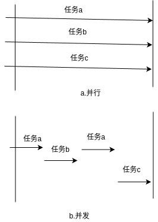

# base

#### 自定义的枚举为什么不能继承抽象枚举Enum<E extends Enum>
  由于定义了**enum**关键字，JVM在编译时会默认加上**final**关键字，使其自定义的枚举不能继承Enum抽象类;在这基础上，还需要了解**语法糖**。
##### 语法糖
* ?-什么是语法糖
  也叫**糖衣语法**，通常来使提高程序的可读性，减少程序中出现的错误。
  java中涉及到枚举、泛性、内部类、swicth、自动装箱和自动拆装、变长参数、增强for循环、等，它们在底层使用的常用的基础知识，如
```java
  public enum AddEum { ... }
```
通过反编译后还原：
```java
 public enum AddEnum extends Enum<AddEnum> { ... }
```

----------------------------------------------------------------------------------------------------------------------------------------------------------------------------------------------
#### Linux查看class文件的方式：
* vim
  1. vi -b xx.class 
  2. :%!xxd 编译成二进制; :%!xxd -r 转成文本格式
* hexdump
* od
----------------------------------------------------------------------------------------------------------------------------------------------------------------------------------------------

#### parallelStream并行流与ForkJoin框架
   ForkJoin框架使用的**分而治之**的思想，把任务划分为很多小任务，然后并行处理，得到结果后进行合并；使用FIFO的队列数据结构，其中这里面还是用到了一种**偷窃算法**，如果有一方的任务先执行完成，而另一方还没有执行完成，这边的进程就会根据偷窃算法从队列的尾部然后再划分任务，然后得到执行。
   parallelStrram是一个并行流，能同时几个进程处理同一个任务；主要依托于ForkJoinPool连接池，相对于ThreadPool来说
##### 区分并行与并发
   并行：同一时间能同时处理几个不同的任务
   并发：同一时间不同间隔内处理不同的任务
   如图：
   

##### 区分ThreadPool和ForkJoinPool的区别
  

----------------------------------------------------------------------------------------------------------------------------------------------------------------------------------------------