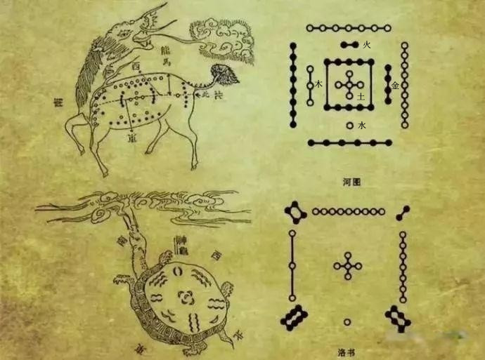
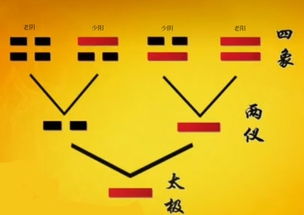
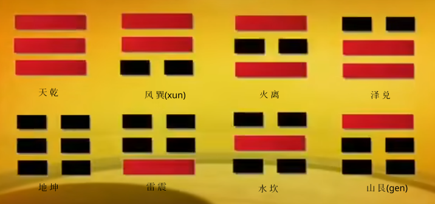
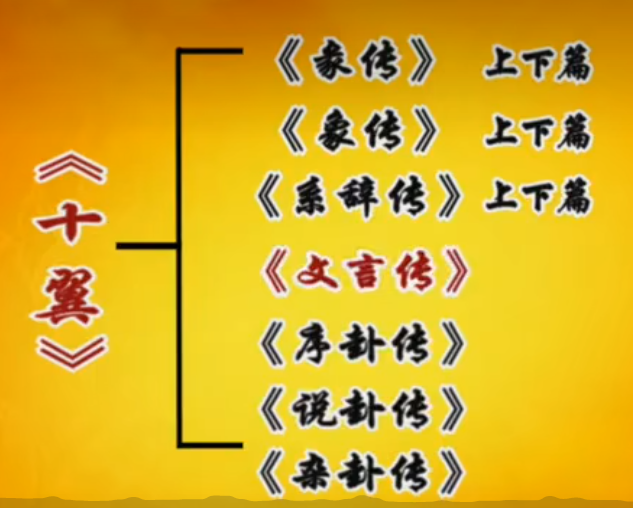
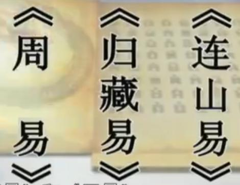

# 周易

### 河图洛书  

### 两仪生四象  

#### 四象生八卦  

#### 了解卦  
* 了解什么是卦名、卦象、爻、爻辞、卦辞    
以乾卦为例：  
乾-->卦名  
横线 --> 卦象  
从下到上为：初九、九二、九三、九四、九五、上九  --> 爻  
* 元、亨、利、贞  
元：慎始  
   做之前需要谋而后作、动机要纯正  
亨：互通有无  
  处事要谨慎  
利：义之和  
  利益要合理  
贞：公正、贞操  
  做人做事要公正    
* 乾卦文言传  

#### 三易  

#### 乾卦 ---- 乾为天(乾上乾下)    
《乾》：元、亨、利、贞。
初九：潜龙勿用。
九二：见龙在田，利见大人。
九三：君子终日乾乾，夕惕若，厉，无咎。
九四：或跃在渊，无咎。
九五：飞龙在天，利见大人。
上九：亢龙有悔。
用九：见群龙无首，吉。  

#### 坤卦 --- 地势坤(坤上坤下)   
《坤》：元亨。利牝马之贞。君子有攸往，先迷后得主，利西南得朋，东北丧朋，安贞吉。  
初六：履霜，坚冰至。  
六二：直、方、大，不习，无不利。  
六三：含章，可贞，或从王事，无成有终。  
六四：括囊，无咎无誉。  
六五：黄裳，元吉。  
上六：龙战于野，其血玄黄。  
用六，利永贞。  

#### <ruby>屯</rp><rt>zh&umacr;n</rp><rt></ruby>卦 --- 水雷屯(坎上震下)  
《屯》：元亨，利贞。勿用有攸往，利建侯。  
初九：磐桓，利居贞。利建侯。  
六二：屯如<ruby>邅</rp><rt>zh&amacr;n</rp><rt></ruby>如，乘马班如。匪寇，婚媾。女子贞不字，十年乃字。  
六三：即鹿无虞，惟入于林中，君子几不如舍，往吝。  
六四：乘马班如，求婚媾。往吉，无不利。  
九五：屯其膏，小贞吉，大贞凶。  
上六：乘马班如，泣血涟如。  

#### 震卦 --- 山水蒙 (艮上坎下)  
《蒙》：亨。匪我求童蒙，童蒙求我。初筮告，再三渎，渎则不告。利贞。  
初六：发蒙，利用刑人，用说桎梏，以往吝。  
九二：包蒙，吉。纳妇，吉。子克家。  
六三：勿用取女，见金夫，不有躬。无攸利。  
六四：困蒙，吝。  
六五：童蒙，吉。  
上九：击蒙，不利为寇，利御寇。  

#### 需卦 --- 水天需(坎上乾下)  
《需》：有孚，光亨。贞吉，利涉大川。  
初九：需于郊，利于恒，无咎。  
九二：需于沙，小有言，终吉。  
九三：需于泥，致蔻至。  
六四：需于血，出自穴。  
九五：需于酒食，贞吉。  
上六：入于穴，有不速之客三人来，敬之终吉。  

#### 讼卦 --- 天水讼(乾上坎下)  
《讼》：有孚至惕，中吉，终凶。利见大人。不利涉大川。  
初六：不永所事，小有言，终吉。  
九二：不克讼，归而逋。其邑下三百户，无<ruby>眚</rp><rt>sh&emacr;ng</rp><rt></ruby>。
六三：食旧徳，贞厉，终吉。或从王事，无成。  
九四：不克讼，复既命渝。安贞吉。  
九五：讼，元吉。  
上九：或锡之鞶带，终朝三<ruby>褫</rp><rt>ch&icaron; </rp><rt></ruby>之。  

#### 师卦 --- 地水师(坤上坎下)  
《师》：贞，丈人吉，无咎。  
初六：师出以律，否臧凶。  
九二：在诗中吉，无咎，王三锡命。  
六三：师或舆尸，凶。  
六四：师左次，无咎。  
六五：田有禽。利执言，无咎。长子帅师，弟子舆师，贞凶。  
上六：大君有命，开国承家，小人勿用。  

#### 比卦 --- 水地比(坎上坤下)  
《比》：吉。原筮，元，永贞，无咎。不宁方来，后夫凶。  
初六：有孚比之，无咎。有孚盈<ruby>缶</rp><rt>f&ocaron;u </rp><rt></ruby>，终来有它，吉。  
六二：比之自内，贞吉。  
六三：比之匪人。  
六四：外比之，贞吉。  
九五：显比，王用三驱，失前禽，邑人不诫，吉。  
上六：比之无首，凶。  

####  畜卦 --- 风天小畜(巽上乾下)   
《畜》：亨。密云不雨。自我西郊。  
初九：复自道，何其咎。吉。  
九二：牵复，吉。  
九三：舆说辐。夫妻反目。  
六四：有孚，血去，惕出无咎。  
九五：有孚挛如，富以比邻。  
上九：既雨既处，尚徳载。妇贞厉。月几望，君子征凶。  

#### 履卦 --- 天泽履(乾上兑下)  
《履》：履虎尾，不咥人。亨。  
初九：素履往，无咎。  
九二：履道坦坦，幽人贞吉。  
六三：瞄能视，跛能履，履虎尾，咥人，凶。武人为于大君。  
九四：履虎尾，愬愬，终吉。  
九五：夬履，贞厉。  
上九：视履考祥，其旋元吉。  

#### 泰卦 --- 地天泰(坤上乾下)  
《泰》：小往大来，吉。亨。  
初九：  拔茅茹，以其汇。征吉。  
九二：包荒，用<ruby>冯</rp><rt>p&iacute;ng </rp><rt></ruby>马，不遐遗。朋亡，得尚于中行。  
九三：无平不陂，无往不复。艰贞无咎。
六四：翩翩，不富以其邻，不戒以孚。  
六五：帝乙归妹，以祉元吉。  
上六：城复于隍，勿用师，自邑告命。贞吉。  

#### 否卦 --- 天地否(乾上坤下)    
《否》：否之匪人，不利君子贞，大往小来。  
初六：拔茅茹以其汇。贞吉，亨。  
六二：包承，小人吉，大人否。亨。  
六三：包羞。  
九四：有命，无咎，畴离祉。  
九五：休否，大人吉。其亡其亡，系于包桑。  
上九：倾否，先否后喜。  

#### 同人卦 --- 天火同人(乾上离下)    
《同人》：同人于野，亨。利涉大川。利君子贞。   
初九：同人于门，无咎。  
六二：同人于宗，吝。  
九三：伏戎于莽，升其高陵，三岁不兴。  
九四：乘其墉，弗克攻，吉。   
九五：同人，先号啕而后笑，大师克，相遇。   
上九：同人于郊，无悔。   

#### 大有卦 --- 火天大有(离上乾下)  
《大有》：  元亨。  
初九：无交害匪咎。艰则无咎。  
九二：大车以载，有攸往，无咎。  
九三：公用享与天子，小人弗克。  
九四：匪其彭，无咎。  
六五：厥孚交如威如，吉。  
上九：自天佑之，吉，无不利。   

#### 谦卦 ---- 地山谦(坤上艮下)  
《谦》：  亨。君子有终。   
初六：谦谦君子，用涉大川，吉。  
六二：鸣谦，贞吉。    
九三：劳谦，君子有终，吉。  
六四：无不利，<ruby>撝</rp><rt>hu&imacr; </rp><rt></ruby>谦。    
六五：不富以其邻，利用侵伐，无不利。    
上六：鸣谦，利用行师征邑国。    

#### 豫卦 ---- 雷地豫(震上坤下)  
《豫》：利见侯，行师。  
初六：鸣豫，凶。  
六二：介于石，不终日，贞吉。  
六三：盱豫，悔，迟有悔。  
九四：由豫，大有得，勿疑。朋盍簪。  
六五：贞吉，恒不死。  
上六：冥豫，成有渝。无咎。  

#### 随卦 ---- 泽雷随(兑上震下)  
《随》：
初九：
六二：
六三：
九三：
九四：
上六：

[周易](https://www.xshiqi.com/category_zyqw/)
[周易](https://www.guwendaquan.com)
[大道仙](https://www.dadaoxian.com/)