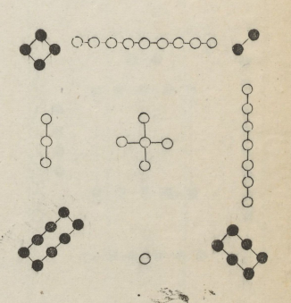

# 食谱
## 河图洛书
* 河图

* 洛书

* 五行对应

## 食谱说明
### 五行、五脏、五官、五色、五味^[https://baijiahao.baidu.com/s?id=1579339630779866514]
|     |     |     |     |     |     |
| --- | --- | --- | --- | --- | --- |
 |   五行  |     土      |     金     |      水     |      木    |     火      |  
 |   五味  |     甘      |    辛      |     咸      |      酸    |     苦      |
 |   五色  |     黄      |    白      |     黑      |      青    |     赤      |
 |   五脏  |    脾       |    肺      |     肾      |      肝    |     心      |
 |   五官  |   口唇   |    鼻      |       耳    |      目     |     舌      |
 |   五体  |     肉      |     皮      |       骨   |       筋    |     脉      |    
 |   外发  |     唇      |   毛        |      发    |       爪    |    面色   |
 

### 香料香型^[http://www.liudachu.com/356.html] ^[https://www.sohu.com/a/461487842_634233]
#### 常见香料^[https://baijiahao.baidu.com/s?id=1666376743896418928]
- 增香型
1. 香叶(增香)

香叶主要起到增香的作用，特别适宜肉类烹调，在炖煮肉类、500g肉类需要1-2片、调制50kg卤水时需要30克左右、在腌制食品中都能够起到很好的增香祛异的作用。
2. 小茴香(增香去腥)

小茴香是一种非常常用的调味品，是烧鱼炖肉、制作卤制食品时经常用到的香料。能够有效去除肉腥味，使之重新添香。用量比例一般500克肉类加小茴香3克、酱汤卤水，一般是50kg汤，加30克
茴香油：200克新鲜茴香切碎，与600克油一同倒入容器中泡一晚上，然后倒入锅中小火熬制1小时即可。炒腥味比较重的菜肴时可以放一些。
3. 八角(大茴香，增香去腥膻等异味)

八角常用用于卤、炸、煮、酱及烧等烹调加工中，常在制作牛羊肉、鸡猪肉的菜肴中加入，可除腥膻等异味，增添芳香气味，并可调剂口味，增进食欲。用量比例一般500克肉类加八角8克、50kg卤水汤，加100克。
4. 丁香

丁香味道是辛、香、苦，主要用于蒸、烧、煨、煮、卤等菜肴，丁香牛肉、丁香鸡、丁香干豆腐、500克肉类加丁香2克、50kg卤水加丁香20克。
5. 草豆蒄

草豆蔻可以有效地祛腥增香，烹饪时，放入草豆蔻可以去异味、增辛香。川菜中常用到草豆蔻，火锅底料里就有草豆蔻，麻辣烫里也有草豆蔻，腌制泡菜也会用到草豆蔻。500克肉类加草豆蔻2克，50kg卤水加30克草豆蒄。
6. 香茅草

香茅草属于亚热带一种香料，新鲜香茅草香气比较浓烈常用于海南鸡肉饭、烤鱼、泰式冬阴功汤及卤水等，让味道更加的鲜嫩奇香。干香茅草常用来打成粉及熬卤水用。卤水的用量比例是5Okg汤或水需要120克香茅草。
7. 百里香

百里香在烹饪海鲜、肉类、鱼类等食物时，加入少量百里香粉可有效祛除腥味，增加菜肴风味。在腌制鸡、鸭、羊肉、牛肉，再用来烤制，香味尤为突出。
8. 孜然

孜然，香辣味浓郁，是烧烤食品必用的佐料，主要用于调味，提取香料等
9. 辛夷

辛夷在炖、烧、焖制各种肉类原料时经常应用，用量比例500克肉类加辛夷2克50kg卤水15克。
10. 荆芥

荆芥有特殊的芳香，并具有去腥膻、增进食欲、除湿痹、消食下气、醒酒、助脾胃等保健功效。可生食，多作凉拌或调味配料或面料，也可熟食，尤其适合炖鱼，800克左右的鱼，需要添加荆芥4克。
11. 紫苏

紫苏味道辛、香，炒田螺吃螃蟹，煮鱼/炖鱼用的最多，味道非常香，也可以用于牛羊肉。
12. 白扣

白扣做为调味料,可去异味,增香辛。卤菜中必备的。一般家里烧鸡烧鸭也必须要，香味十足。
13. 薄荷

1、新鲜的薄荷可以拌制各种荤料原料，比如鸡、牛肉、猪下货，增香效果特别明显。
2、可以腌制牛肉，500克牛肉可以添加薄荷水15克。
3、牛肋肉600克洗净，切成块，用高压锅压煮至牛肉软烂。取一个沙煲烧热，铺入新鲜薄荷叶90克，放入熟牛肋肉350克，淋入热的、压牛肉的清汤300克，上桌加热即可。
14. 桂皮

桂皮性大热，味辛甘，有小毒，增加香味。
15. 肉蔲

肉蔻香气浓烈、卤料中必备的、用量比例500g食材加肉蔻2克、50kg卤队加30克肉蔻。
- 辛辣型香辛料
16. 花掓

花椒主要增加麻味，用于卤水、炖肉、以及调制花椒油，椒麻汁。
常用搭配
（1）、麻椒60克洗净，放入开水中浸泡3分钟，然后沥干备用。
（2）、锅中放入菜籽油300克，烧到8成热时，放入洋葱30克、大蒜15克炸香后捞出。
（3）、将油温降到6成热时，放入麻椒、香叶3片、桂皮8克、盖上锅盖，静置5小时，花椒油就做好了。
（4）、如果是制做卤水或制做酱汤，40千克的水或汤添加花椒的用量不要超过130-160克。
（5）、鲜花掓汁、去籽鲜花椒60克，红小米辣10克、胡萝卜30克，白糖、白醋、芝麻油各4克，盐、味精各3克，水140克。所有原料放入粉碎机内，粉碎成蓉即可。
17. 辣椒

辣椒主要是起到调味作用，常用语各种家常菜，熬制红油，以及火锅底料，或卤水。
（1）、红油辣子、色拉油3斤、菜籽油2斤、二荆条280克、小米椒280克、桂皮6克、八角6克、香叶2克、小茴香4克、丁香1克、油和辣椒的比例是4:1。
（2）、将锅烧热，放入100克菜籽油、100克色拉油油温5成热，然后下入二荆条和小米椒，小火慢炒，直到炒干炒香为止。
（3）、把炒好的辣椒放凉，然后磨成辣椒面使用。
（4）、把八角、丁香、桂皮、香叶、小茴香也磨成粉末，放入到辣椒面的碗中。
（5）、把色拉油、菜籽油混合，全部烧到油温6层热，然后一边搅拌辣椒面，一边倒油。
（6）、最后搅拌好的辣椒面，放凉后，盖锅盖放置一晚即可使用，超级的香。香味十分浓郁，辣味醇厚。
（7）、卤水一般50千克的水或汤添加干辣椒的用量不要超过60克-500克。
18. 白胡椒

白胡椒味道辛香，性辛温，温中散寒，下气。多用于祛异味、增辣味、香味。
（1）、白胡椒、适合做羊肉、酸辣汤、烧鱼。汤的话一般4人量的汤用9克。
（2）、用来腌制一些带有异味的肉类原料，如腌制牛、羊肉，每500克肉需要添加5克胡椒粉。
（3）、如果用来制作卤水或者酱汤，50千克的水或汤添加白胡椒的用量不要超过70克-90克。
19. 黑胡椒

黑胡椒主要是去腥提香效，赠辣味的作用，常用用各种炖烧扒蒸鱼和肉，甚至有专门突出调料的黑胡椒牛排，黑胡椒牛柳等。
（1）、黑胡椒粒500克、洋葱60克黄油80克、青椒红椒60克、牛骨汤800克、蚝油60克、美极鲜味汁50克。
（2）、锅起火不放油、放入黑胡椒粒炒香、取出捣碎。
（3）起锅放入黄油，油温4成热，放入洋葱丁、青红椒丁炒香，放入黑胡椒碎，倒入牛骨汤、鲜味汁、蚝油大火烧沸转小火熬制浓稠即可。
- 祛异去血腥类香辛料
20. 白芷

白芷味芳香微苦，主要作用是除腥去膻、脱臭除异味、对于鱼腥和羊肉膻味特别管用、常用在卤水、香肠、腌肉、炖鱼添加1-2片遮腥作用明显、炖1000克羊肉加5克白芷，在火锅底料和卤料时，能够很好的提味，保鲜，防止腐化的功效。
（1）、白芷川芎鱼头汤：鱼头1000克、川穹5克、白芷5克、生姜5克。
制做方法：白芷川穹洗净后浸泡一会，鱼头去腮洗净后倒入油锅里煎制，再撒入适量绍酒，然后一起与生姜放入炖锅里，加入冷水1300ml|盖上盖炖2小时。炖好后加入适量盐和鸡粉、胡椒粉、生抽即可。
2、卤水：50kg卤水水，放白芷30克。
21. 草果

草果具有浓郁的辛辣香味，能除腥膻味，增进菜肴味道，被誉为调味品中的“五香之一”。在炖鱼，炖肉时加入草果味道口感会更好，在煮牛羊肉时，加入草果，牛羊肉会更加清香可口，也常用在卤水，和其他家常菜中。
用量比例：500g肉类，加草果2克、50kg卤小加草果45克。
22. 山奈

山奈具有较醇浓的芳香气味，微苦，有去腥解腻防腐的作用，山奈不仅能去腥，还能提鲜增香，能诱出食物的香味，增进食欲。烹调中多用于烧、卤、麻辣火锅、炖牛羊肉，或猪蹄、鸡肉等，用三奈和生姜做鱼，既能解除鱼腥，又可使鱼酥嫩相宜，香气横溢。
用料比例：500g肉类加山奈6克、50kg卤水加山奈80克。
23. 肉桂

肉桂是最早被人类使用的香料之一，主要作用是遮盖所有红肉类食材的异味。它几乎是卤水组方的必备香料，同时也是五香粉的必备成分之一。常用于炖牛羊肉、鸡肉、猪蹄等每1kg肉类放肉桂6克、50kg卤水加肉蔻25克、1kg油脂需要3克肉桂，在做卤肉制品时肉桂和肉蔻来搭配使用，能使肉品本身物质的油腥味结合，最终激发和突出肉香味。
24. 木香

木香在菜肴中主要起到祛除异味，增加香味的作用，常与其他香料配制复合香辛料用于肉制品加工，可增加酱卤制品的复合香味。
500g肉类食材的用量，需要木香2克、50kg卤水的用量是40克木香。
25. 干姜

干姜是五香卤水极其重要的料，真正的的干姜是经过特殊种植而成，水分少而辣味重，并不是鲜姜晒干就可以的。川式五香卤水中，干姜就是必不可少的一味料，五香粉里就有这种干姜。
26. 良姜

良姜鲜的又叫干南姜，它的突出的功效就是祛异功能强大，并且还有着极强的定香功能，尤其是在卤制肉类食材，特别是一些腥气极重的食材如卤制蹄类时一定要用良姜，而不是生姜或是干姜，主要就是因为生姜与干姜在异味极强的食材之后，不仅对那些极腥的异味束手无策，甚至还会变成它们的帮凶，这可是许多老师父才知道的秘密。
1kg肉类食材的用量，需要良姜6g、50kg卤水的用量，需良姜50克。
27. 枳壳

枳壳味辛甘,酸，在菜肴中主要起到去腥，增香的作用。
- 调色类香辛料
28. 姜黄

姜黄可赋予食品黄色，常用于制作咖喱粉，或者需要色泽金黄的鸡菜，除此之外它的调味作用在于能够用来遮盖异味，多用于调制卤水或酱汤，以及在西餐中可以来烹制牛羊肉。
29. 藏红花

藏红花因为比较昂贵，也被称为“香料皇后”，多用于高端菜来调色，往往只需添加少许便会带出格外鲜亮的色泽。
每藏红花4克配清水400克，藏红花汁入锅的最佳时机是菜肴出锅前10秒，时间太长颜色效果会降低。
30. 紫草

紫草是卤水、火锅底料当中常见的调色原料。在用紫草调色时，紫草与油脂的比例为1∶1000。先把油脂烧到五六成热，然后把紫草放到长柄密漏勺里，伸入油锅边炸边搅动，见油脂呈酒红色时，捞出紫草取油。如果熬制卤水，是50kg卤水，30克紫草。
- 滋补类香辛料
31. 当归

当归的性格比较直白，苦味和药味都比较重，也是滋补佳品，同时还能遮盖羊肉膻味。在卤菜制作当中，当归厚重的香味，以及本身特有的回味的香型具有鲜明的特色，是很多单纯的辛香料无法比拟的，当归的用量占整个食材重量的0.01%左右，如果是炖汤，可以搭配乌鸡、猪瘦肉、鸽子、老鸭等很多食材。一般十人份的炖汤，需要添加当归4克，50kg卤水的用量是当归20克。
32. 淮山

淮山主要是增加汤料的滋补功效。卤水50kg卤水需要加淮山20克。
（1）、淮山西洋参排骨汤：洋参 25克， 淮山40克 ，芡实50克， 排骨500克， 陈皮 ，精盐少许。
（2）、淮山党参鹌鹑汤：党参15克，淮山40克，鹌鹑2只，猪瘦肉250克，生姜3片。
- 香料搭配配方
33. 秘制十三香配方
用料：八角500克，山奈200克，丁香150克，小茴香500克，草果400克，白蔻400克，香叶500克，干藿香300克，灵草600克，排草600克，孜然500克，桂皮300克，干姜800克。
制做工艺：以上原料小火炒香，晾凉后磨成细粉。适用于烧、拌、炒等要求快速出香味的菜品，如烤肉或者油炸后再稍加煸炒的菜，用起来比较方便，很实用。
34. 五香粉
五香粉的基本成份是磨成粉的花椒、肉桂、八角、丁香、小茴香籽。有些配方里还有干姜、豆蔻、甘草、胡椒、陈皮等。主要用于炖制的肉类或者家禽菜肴，或是加在卤汁中增味，或拌馅。五香粉因配料不同，它有多种不同口味和不同的名称，如麻辣粉、鲜辣粉等。
（1）、 砂仁 60g 丁香 12g 豆蔻 7g 肉桂 7g 三柰 12g。
（2）、大料 20g 干姜 5g 小茴香 8g 花椒 18g 陈皮 6g 花椒 18g。
（3）、 大料 52g 桂皮 7g 三柰 10g 白胡椒 3g 砂仁 4g 干姜 17g 甘草 7g。
35. 正宗四川卤水
调味料：川盐300克、冰糖250克、老姜500克、大葱300克、料酒100克、鸡精20克、味精20克。
香料：山奈30克、八角20克、丁香10克、白蔻50克、茴香20克|香叶100克、白芷50克、草果50克、香草60克、橘皮30克、桂皮80克、筚拨50克、千里香30克、香茅草40克、排草50克、干辣椒50克。
汤原料：水50kg、鸡骨架3500克、和筒子骨1500克。
36. 五香卤水
最传统的五香卤水，它的五香味由八角、花椒、丁香、桂皮和小茴香组成。而配制五香卤水，其最基础的法则就是要突出八角的味道，它的用量就是第一，变化的事其他佐料和辅料。然后根据所卤的食材特质进行变化，一般君臣佐使料在香料的比例基本是: 4:2:1就可以了。
37. 正宗潮州卤水
原材料：老汤50kg、生抽3千克、冰糖2千克、老抽300克、绍兴花雕酒200克、甘草20克、桂皮20克、八角20克、丁香5克、花椒10克、小茴香10克、香叶20克。
38. 重庆火锅底料
炒制原料：郫县豆瓣800克、干辣椒1000克、生姜400克、大红袍花椒300克、葱100克、冰糖50克、黄酒100克、永川豆豉200克、醪糟150克、盐100克。
香料：草果50克、白豆蔻75克、山奈35克、丁香5克、小茴香25克、砂仁30克、荜拨30克、香叶45克、香果20克、八角35克、桂皮25克、黄孜子20克。
油料：鸡油500克、熟菜子油3500克、牛油3500克、色拉油300克
39. 河鲜原味火锅底料
原料：五花肉17千克、色拉油7.5千克、菜籽油25千克、麦芽糖4瓶、料酒3瓶、郫县豆瓣1.5千克、青花椒1.5千克、泡椒30千克丶泡姜17千克、酸泡菜10千克、老姜5千克、大蒜2.5千克。
香料：八角25克、三奈10克、香果15克、小茴15克、香叶15克、草果10克、白蔻10克。
味碟：香菜末15克、香葱花10克、大头菜粒20克、油酥黄豆20克、熟花生碎10克、红小米辣椒末15克、青辣椒末10克、香油25克。
40. 新派毛肚火锅底料
新派毛肚火锅适当减低了传统毛肚火锅中的麻辣刺激味，使之麻辣适度而不燥烈，味道鲜香而不油腻，汤汁红亮而不浓稠。
调料6份：菜籽油3千克、牛油1.5千克、郫县豆瓣1.5千克、干辣椒250克、生姜100克、大蒜200克、大葱300克、冰糖150克、醪糟500克。
香料：八角100克、山奈50克、桂皮50克、小茴香50克、草果25克、紫草25克、香叶10克、香草10克、丁香5克。

#### 分类
1. **五香型**：八角、小茴香、丁香、桂皮、花椒
2. **辛香型(辛辣型)**：麻椒、荜拨、干辣椒、干姜、白蔻、胡椒、芥末
3. **甘香型(浓香型、甘甜型)**：甘草、桂皮、排草、罗汉果
4. **上色型**：栀子、紫草、红曲米、姜黄
5. **清香型**：香茅草、千里香、香菜籽、灵草
6. **芳香型**：八角、桂皮、香叶、小茴香
7. **苦香型(混合香型)**：白芷、山奈、肉蔻、良姜
8. **酸香型**：柠檬
9. **清凉型**：薄荷、罗勒、辛夷、香茅草
10. **五味型**：五味子

### 可用食材分类
谷类：
豆类：
菜类：
果类：
水类：
兽类：
禽类：
鱼类：
味类：

### 杂粮类
主要是以五谷杂粮为主
#### 五色米团
* 设计方案
黄居中；红在北；黑在南；青在左；白在右
* 食材
 小黄米(黄)、粳米(白)、红米(红)、黑米(黑)、碧粳米(青)
* 料量：
小黄米：5；黑米：1；红米：2；碧粳米：3；粳米：4
* 选材
根据季节、地域、温度等作为条件选择
* 颜色
白入肺；黄入脾；红入心；黑入肾；青入肝；
* 制作方式

* 食材性质

#### 五色米线
* 设计方案
每一根面条都有五种颜色
* 食材
小黄米(黄)、粳米(白)、红米(红)、黑米(黑)、碧粳米(青)
* 料量
* 选材

* 颜色
白入肺；黄入脾；红入心；黑入肾；青入肝；
* 制作方式

* 食材性质

#### 玉米红豆粑
* 设计方案
红豆作为馅
* 食材
玉米(鲜)、糯米粉、红豆

### 果类搭配

### 混合搭配类
可能存在菜类与兽类、菜类与五谷杂粮类、菜类与菜类、菜类与禽类、禽类与兽类、禽类与禽类、兽类与兽类等

### 味类搭配类
根据味类来搭配使用

## 参考文献