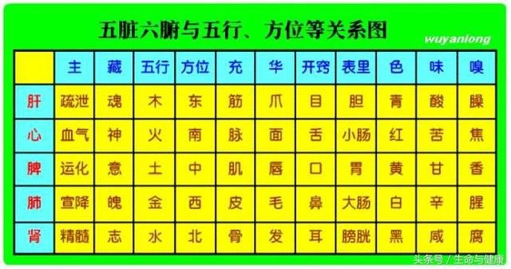

# 食谱
## 河图洛书
* 河图

* 洛书

* 五行对应

## 食谱说明
### 五行、五脏、五官、五色、五味^[https://baijiahao.baidu.com/s?id=1579339630779866514]
|     |     |     |     |     |     |
| --- | --- | --- | --- | --- | --- |
 |   五行  |     土      |     金     |      水     |      木    |     火      |  
 |   五味  |     甘      |    辛      |     咸      |      酸    |     苦      |
 |   五色  |     黄      |    白      |     黑      |      青    |     赤      |
 |   五脏  |    脾       |    肺      |     肾      |      肝    |     心      |
 |   五官  |   口唇   |    鼻      |       耳    |      目     |     舌      |
 |   五体  |     肉      |     皮      |       骨   |       筋    |     脉      |    
 |   外发  |     唇      |   毛        |      发    |       爪    |    面色   |
 

### 香料香型^[http://www.liudachu.com/356.html] ^[https://www.sohu.com/a/461487842_634233]
#### 分类
1. **五香型**：八角、小茴香、丁香、桂皮、花椒
2. **辛香型(辛辣型)**：麻椒、荜拨、干辣椒、干姜、白蔻、胡椒、芥末
3. **甘香型(浓香型、甘甜型)**：甘草、桂皮、排草、罗汉果
4. **上色型**：栀子、紫草、红曲米、姜黄
5. **清香型**：香茅草、千里香、香菜籽、灵草
6. **芳香型**：八角、桂皮、香叶、小茴香
7. **苦香型(混合香型)**：白芷、山奈、肉蔻、良姜
8. **酸香型**：柠檬
9. **清凉型**：薄荷、罗勒、辛夷、香茅草
10. **五味型**：五味子

### 可用食材分类
谷类：
豆类：
菜类：
果类：
水类：
兽类：
禽类：
鱼类：
味类：

### 杂粮类
主要是以五谷杂粮为主
#### 五色米团
* 设计方案
黄居中；红在北；黑在南；青在左；白在右
* 食材
 小黄米(黄)、粳米(白)、红米(红)、黑米(黑)、碧粳米(青)
* 料量：
小黄米：5；黑米：1；红米：2；碧粳米：3；粳米：4
* 选材
根据季节、地域、温度等作为条件选择
* 颜色
白入肺；黄入脾；红入心；黑入肾；青入肝；
* 制作方式

* 食材性质

#### 五色米线
* 设计方案
每一根面条都有五种颜色
* 食材
小黄米(黄)、粳米(白)、红米(红)、黑米(黑)、碧粳米(青)
* 料量
* 选材

* 颜色
白入肺；黄入脾；红入心；黑入肾；青入肝；
* 制作方式

* 食材性质

#### 玉米红豆粑
* 设计方案
红豆作为馅
* 食材
玉米(鲜)、糯米粉、红豆

### 果类搭配

### 混合搭配类
可能存在菜类与兽类、菜类与五谷杂粮类、菜类与菜类、菜类与禽类、禽类与兽类、禽类与禽类、兽类与兽类等

### 味类搭配类
根据味类来搭配使用

## 参考文献