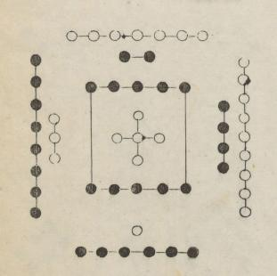

# 食谱
## 河图洛书
* 河图

* 洛书

* 五行对应

## 食谱说明
### 可用食材分类
谷类：
豆类：
菜类：
果类：
水类：
兽类：
禽类：
鱼类：
味类：

### 杂粮类
主要是以五谷杂粮为主
#### 五色米团
* 设计方案
黄居中；红在北；黑在南；青在左；白在右
* 食材
 小黄米(黄)、粳米(白)、红米(红)、黑米(黑)、碧粳米(青)
* 料量：
小黄米：5；黑米：1；红米：2；碧粳米：3；粳米：4
* 选材
根据季节、地域、温度等作为条件选择
* 颜色
白入肺；黄入脾；红入心；黑入肾；青入肝；
* 制作方式

* 食材性质

#### 五色米线
* 设计方案
每一根面条都有五种颜色
* 食材
小黄米(黄)、粳米(白)、红米(红)、黑米(黑)、碧粳米(青)
* 料量
* 选材

* 颜色
白入肺；黄入脾；红入心；黑入肾；青入肝；
* 制作方式

* 食材性质

#### 玉米红豆粑

### 果类搭配

### 混合搭配类
可能存在菜类与兽类、菜类与五谷杂粮类、菜类与菜类、菜类与禽类、禽类与兽类、禽类与禽类、兽类与兽类等

### 味类搭配类
根据味类来搭配使用